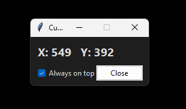

# Cursor Tracker

Tkinter app that shows real‑time mouse coordinates with an "Always on top" toggle, can be used to build crosshair position based macros/scripts.



Run (PowerShell):
```
$env:PYTHONPATH = "$pwd/src"; python -m cursor_tracker
```

Build .exe (Windows):
```
powershell -ExecutionPolicy Bypass -File .\scripts\build.ps1
```

